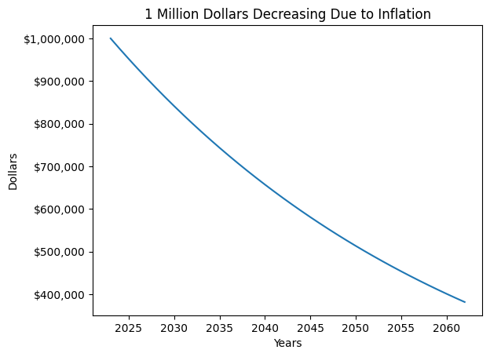
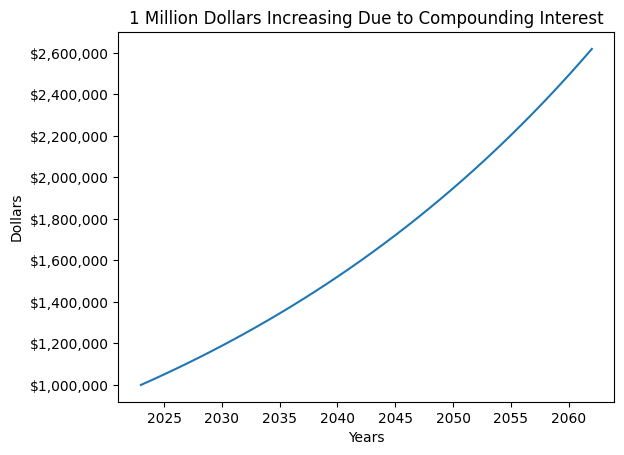
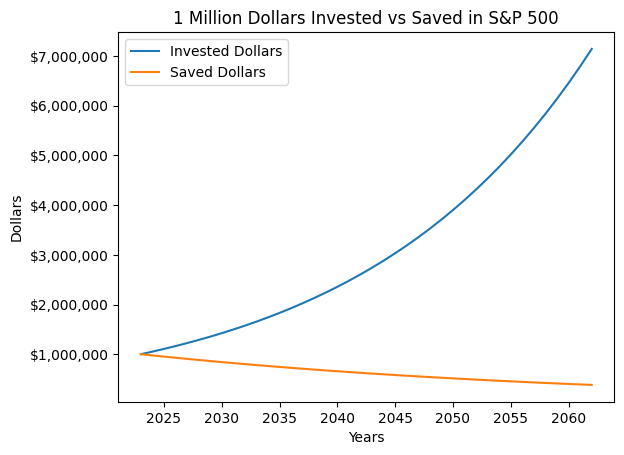
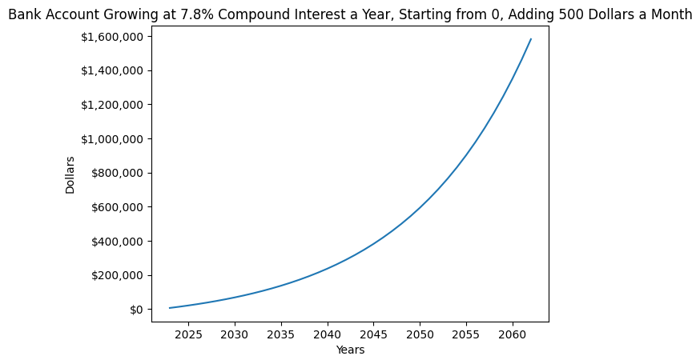
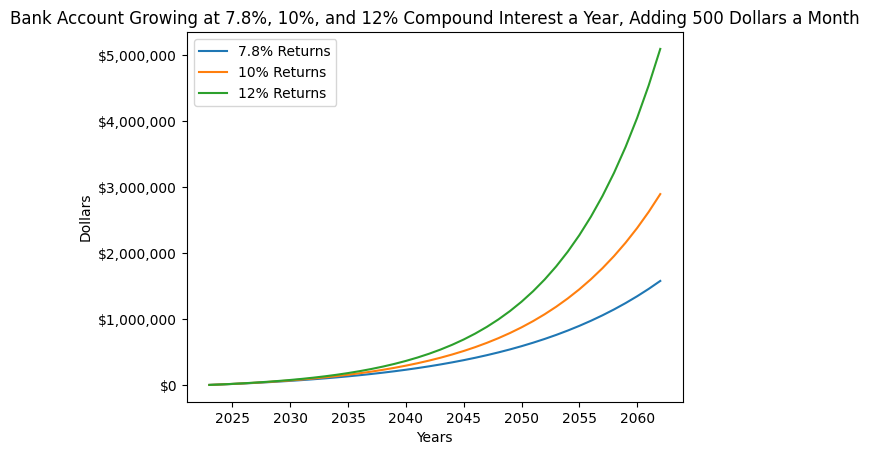
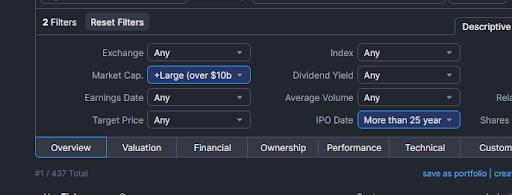
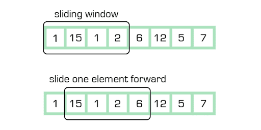
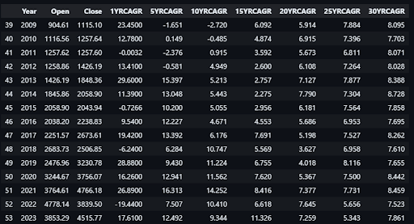
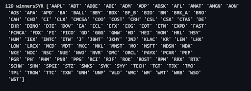

## The Danger of Not Investing

**Inflation.** The truth is that saving money doesn’t build wealth. Every dollar that you store in your mattress devalues over time.

$1 million in today’s currency will only be worth $400k by the time we retire… and that’s assuming we remain the world’s exchange currency.



## How Investing Counteracts Inflation

**Compound interest** is like anti-inflation, only more powerful. 

40 years of 2.5% compound interest grows your money by 176%.



## Compound interest vs Inflation

Luckily, **achieving compound interest greater than inflation is very easy**

The S&P 500, which basically represents the stock market, brings an average of 7.8% return a year.




## Is that all there is to it?

Pretty much. If your goal is to combat inflation and have a 100% guarantee that you will have a nest egg to retire on and never be broke, **investing in an S&P 500 index fund the closest to a sure thing as exists in the stock market. Put in $500 a month and you’re retiring a millionaire easily.**




## What if I want more?

Retiring with $1.7m sounds nice and all, but what if i want more? What if i don’t just want to ride the market, I want to beat it? How do people like Warren Buffet get rich? **If the S&P 500 will get you 7.8%, what if we consider that the minimum rather than the goal?**


## Different Rates of Returns



## How to Beat the S&P 500

**The S&P 500**, like any index, **is just a collection of stocks at different weights** (called components)

So if the 500 stocks within the S&P average 7.8%, **all we need to do is pick a different collection of stocks that come out to more** than that.

There are thousands, if not tens of thousands of potential investments to choose from, how on earth can we figure out which ones are the best?

## Narrow the Field a Bit

According to Finviz, **there are 289 stocks that are both at least 33 years old (IPO before 1990) and of large market cap (over $10 billion.)** This is a lot easier to deal with than 10,000.



## What do we do with these 289 stocks?

How can we calculate how good a company performed over time and might perform in the future?


|       | 2000 | 2001 | 2002 | 2003 | 2004 | 2005 | 2006 | 2007 | 2008 | 2009 |
|-------|------|------|------|------|------|------|------|------|------|------|
| **Stock A Growth** | 10   | 12   | 14   | 16   | 18   | 20   | 22   | 24   | 26   | 28   |
| **Stock B Growth** | 10   | 13   | 16   | 19   | 20   | 21   | 22   | 23   | 24   | 27   |

## Sliding Window

The best way to analyze how something will perform over a given period of time is to take every possible combination of that length of time, in programming this is called the sliding window.




## What do we do with these 289?

Say we want to analyze a 3 year time period, then we should take the 3 year sliding window.

|       | 2000 | 2001 | 2002 | 2003 | 2004 | 2005 | 2006 | 2007 | 2008 | 2009 |
|-------|------|------|------|------|------|------|------|------|------|------|
| **Stock A Growth** | <span style="background-color: red;">10</span> | <span style="background-color: red;">12</span> | <span style="background-color: red;">14</span> | 16   | 18   | 20   | 22   | 24   | 26   | 28   |
| **Stock B Growth** | <span style="background-color: red;">10</span> | <span style="background-color: red;">13</span> | <span style="background-color: red;">16</span> | 19   | 20   | 21   | 22   | 23   | 24   | 27   |

Window 1: Stock A growth averages 18.32% per year, Stock B growth averages 26.49% per year

|       | 2000 | 2001 | 2002 | 2003 | 2004 | 2005 | 2006 | 2007 | 2008 | 2009 |
|-------|------|------|------|------|------|------|------|------|------|------|
| **Stock A Growth** | 10   | <span style="background-color: red;">12</span> | <span style="background-color: red;">14</span> | <span style="background-color: red;">16</span> | 18   | 20   | 22   | 24   | 26   | 28   |
| **Stock B Growth** | 10   | <span style="background-color: red;">13</span> | <span style="background-color: red;">16</span> | <span style="background-color: red;">19</span> | 20   | 21   | 22   | 23   | 24   | 27   |

Window 1: Stock A growth averages 15.47% per year, Stock B growth averages 20.89% per year

|       | 2000 | 2001 | 2002 | 2003 | 2004 | 2005 | 2006 | 2007 | 2008 | 2009 |
|-------|------|------|------|------|------|------|------|------|------|------|
| **Stock A Growth** | 10   | 12   | <span style="background-color: red;">14</span> | <span style="background-color: red;">16</span> | <span style="background-color: red;">18</span> | 20   | 22   | 24   | 26   | 28   |
| **Stock B Growth** | 10   | 13   | <span style="background-color: red;">16</span> | <span style="background-color: red;">19</span> | <span style="background-color: red;">20</span> | 21   | 22   | 23   | 24   | 27   |

Window 1: Stock A growth averages 13.38% per year, Stock B growth averages 11.8% per year

Now that we have this concept, we can figure out every possible combination of any amount of time for any stock. We can analyze every 1 year window, 2 year window, 3 year window, etc.

|       | 2000 | 2001 | 2002 | 2003 | 2004 | 2005 | 2006 | 2007 | 2008 | 2009 |
|-------|------|------|------|------|------|------|------|------|------|------|
| **Stock A Growth** | <span style="background-color: red; background: linear-gradient(to right, red 0%, red 30%, blue 30%, blue 70%, red 70%, red 100%); color: white;">10</span> | <span style="background-color: red; background: linear-gradient(to right, red 0%, red 30%, blue 30%, blue 70%, red 70%, red 100%); color: white;">12</span> | <span style="background-color: red; background: linear-gradient(to right, red 0%, red 30%, blue 30%, blue 70%, red 70%, red 100%); color: white;">14</span> | <span style="background-color: blue; color: white;">16</span> | <span style="background-color: blue; color: white;">18</span> | 20   | 22   | 24   | 26   | 28   |
| **Stock B Growth** | <span style="background-color: red; background: linear-gradient(to right, red 0%, red 30%, blue 30%, blue 70%, red 70%, red 100%); color: white;">10</span> | <span style="background-color: red; background: linear-gradient(to right, red 0%, red 30%, blue 30%, blue 70%, red 70%, red 100%); color: white;">13</span> | <span style="background-color: red; background: linear-gradient(to right, red 0%, red 30%, blue 30%, blue 70%, red 70%, red 100%); color: white;">16</span> | <span style="background-color: blue; color: white;">19</span> | <span style="background-color: blue; color: white;">20</span> | 21   | 22   | 23   | 24   | 27   |

In red, 3 year window, in blue, 5 year window.

## Now let’s put it on steroids

Let’s calculate **every possible sliding window** of **every possible size** for **every possible stock**.

S&P 500 shown below:



## So what do we do with all this data?


Remember, **our goal here is to beat the S&P 500**, so we will **compare every stock’s sliding performance in 2 ways:**

**Compare the overlapping windows of the stock to the S&P for similar years.** For example, compare 10 year windows of S&P vs the stock for 01-11, 02-12, 03-13, etc. Tally which stock wins more often, and you can conclude which is a better 10 year investment.

**Find the median CAGR for a certain window length.** For example, if you take all the S&P’s 10 year windows, and the median CAGR is 10%, and all of stock A’s 10 year windows, and the median CAGR is 15%, you can conclude stock A is a better 10 year investment.

## Side Note

Because we’re trying to predict future performance, **recent windows should be weighted more heavily,** meaning 2013-2023 performance is more meaningful than 1993-2003.

I did not account for this in my calculations, but I DID **exclude all stocks that had a lower CAGR of each window size than the S&P 500 from the dataset.** I call these the super losers. Meaning **if the S&P outperformed stock A for the last 1 year, and the last 5 years, and the last 10 years, 15, 20, 25, and 30 years, stock A is a super loser, and I immediately removed it from consideration.**


```python
def is_bad_stock(stock, sp500):
    if (stock.loc[stock['Year'] == 2023, '1YRCAGR'].values[0] < sp500.loc[sp500['Year'] == 2023, '1YRCAGR'].values[0] and
        stock.loc[stock['Year'] == 2023, '5YRCAGR'].values[0] < sp500.loc[sp500['Year'] == 2023, '5YRCAGR'].values[0] and
        stock.loc[stock['Year'] == 2023, '10YRCAGR'].values[0] < sp500.loc[sp500['Year'] == 2023, '10YRCAGR'].values[0] and
        stock.loc[stock['Year'] == 2023, '15YRCAGR'].values[0] < sp500.loc[sp500['Year'] == 2023, '15YRCAGR'].values[0] and
        stock.loc[stock['Year'] == 2023, '20YRCAGR'].values[0] < sp500.loc[sp500['Year'] == 2023, '20YRCAGR'].values[0] and
        stock.loc[stock['Year'] == 2023, '25YRCAGR'].values[0] < sp500.loc[sp500['Year'] == 2023, '25YRCAGR'].values[0] and
        stock.loc[stock['Year'] == 2023, '30YRCAGR'].values[0] < sp500.loc[sp500['Year'] == 2023, '30YRCAGR'].values[0]):
        return True
    else:
        return False
```
## Method A - Overlaps

Let’s look at every overlapping 30 year window between S&P 500 and Stock A. Again, for example, 73-03, 74-04, 75-05, 76-06, etc. This would mean we have 20 windows: 73-03 -> 93-23. If Stock A wins more than 50% of these window matchups (more wins than losses), we call this a 30 year winner.

Now we do this for 25, 20, 15, 10, and 5 year windows. If a stock wins more than 50% of ALL lengths of matchups, aka ALL sizes of windows, that stock is a super winner. From the 289 stocks that are 33 years old and $10 billion market cap or more, 129 are super winners.




## Overlaps re-emphasized

Again… let’s really understand what this means. This means that, historically, for these 129 stocks, if you buy in at ANY time, and hold for ANY length of time, your odds of beating the S&P 500 are OVER 50%. You will MOST LIKELY beat the market.

## Method B - Median CAGRs

The next method is by comparing the median CAGRs. This method is much simpler. Instead of comparing every overlapping window to every other, just get the median CAGR of every length of time for every Ticker. I did this only for the super winners from the last method.


Here are some of the top stocks by median CAGR over 30 years:
| Ticker | 30YR_median | 25YR_median | 20YR_median | 15YR_median | 10YR_median | 5YR_median |
|--------|-------------|-------------|-------------|-------------|-------------|------------|
| MNST   | 27.958      | 31.4815     | 35.565      | 35.2545     | 24.323      | 18.7125    |
| NVR    | 25.613      | 25.9985     | 27.475      | 26.395      | 20.941      | 20.8315    |
| UNH    | 23.359      | 19.678      | 18.8795     | 17.015      | 22.6525     | 24.881     |
| JKHY   | 23.11       | 19.5855     | 17.426      | 15.1645     | 16.996      | 17.4885    |


## Results and Findings - Overlapping Window Matchups

The stocks that beat the S&P 500 the most consistently are:

| Ticker | 30YRWins | 30YRLosses | 25YRWins | 25YRLosses | 20YRWins | 20YRLosses | 15YRWins | 15YRLosses | 10YRWins | 10YRLosses | 5YRWins | 5YRLosses | 5 Year Ratio |
|--------|----------|------------|----------|------------|----------|------------|----------|------------|----------|------------|---------|-----------|-------|
| FI     | 8        | 0          | 13       | 0          | 18       | 0          | 23       | 0          | 28       | 0          | 30      | 3         | 10.0 : 1  |
| SYK    | 15       | 0          | 20       | 0          | 25       | 0          | 30       | 0          | 35       | 0          | 36      | 4         | 9.0 : 1   |
| RJF    | 11       | 0          | 16       | 0          | 21       | 0          | 26       | 0          | 30       | 1          | 32      | 4         | 8.0 : 1   |
| ADP    | 24       | 0          | 29       | 0          | 34       | 0          | 39       | 0          | 41       | 3          | 43      | 6         | 7.17 : 1  |
| IEX    | 5        | 0          | 10       | 0          | 15       | 0          | 20       | 0          | 24       | 1          | 26      | 4         | 6.5 : 1   |
| DHR    | 24       | 0          | 27       | 2          | 31       | 3          | 35       | 4          | 40       | 4          | 42      | 7         | 6.0 : 1   |
| NDX    | 9        | 0          | 14       | 0          | 19       | 0          | 23       | 1          | 26       | 3          | 29      | 5         | 5.8 : 1   |
| JKHY   | 9        | 0          | 14       | 0          | 19       | 0          | 24       | 0          | 28       | 1          | 29      | 5         | 5.8 : 1   |
| GGG    | 22       | 0          | 27       | 0          | 31       | 1          | 35       | 2          | 40       | 2          | 40      | 7         | 5.71 : 1  |
| COST   | 8        | 0          | 13       | 0          | 18       | 0          | 22       | 1          | 27       | 1          | 28      | 5         | 5.6 : 1   |
| ADBE   | 8        | 0          | 13       | 0          | 18       | 0          | 23       | 0          | 27       | 1          | 28      | 5         | 5.6 : 1   |
| TECH   | 5        | 0          | 10       | 0          | 15       | 0          | 19       | 1          | 23       | 2          | 25      | 5         | 5.0 : 1   |
| BRK_A  | 15       | 0          | 20       | 0          | 25       | 0          | 30       | 0          | 34       | 1          | 33      | 7         | 4.71 : 1  |
| ROST   | 9        | 0          | 14       | 0          | 19       | 0          | 23       | 1          | 28       | 1          | 28      | 6         | 4.67 : 1  |
| ITW    | 22       | 0          | 27       | 0          | 32       | 0          | 37       | 0          | 41       | 1          | 38      | 9         | 4.22 : 1  |
| TMO    | 22       | 0          | 26       | 1          | 30       | 2          | 33       | 4          | 32       | 10         | 38      | 9         | 4.22 : 1  |
| EXPD   | 10       | 0          | 15       | 0          | 20       | 0          | 21       | 4          | 21       | 9          | 28      | 7         | 4.0 : 1   |
| UNH    | 10       | 0          | 15       | 0          | 20       | 0          | 25       | 0          | 30       | 0          | 28      | 7         | 4.0 : 1   |
| WSO    | 10       | 0          | 15       | 0          | 20       | 0          | 24       | 1          | 29       | 1          | 28      | 7         | 4.0 : 1   |


Funnily enough, another index, the Nasdaq (NDX), is one of the most reliable ways to beat the S&P 500. The Nasdaq has NEVER underperformed the S&P 500 over a 20 year period

If what we care about is beating the S&P 500, and not necessarily the margin by which we do so, Fiserv is historically the most consistent company. Over every possible 30, 25, 20, 15, or 10 year period, Fiserv has beaten the S&P, and beat it for 30 out of 33 possible 5 year periods.

## Results and Findings - Medians

The stocks that have the 20 highest median CAGR over 30 year periods are:

| Unnamed: 0 | Ticker | 30YR_median | 25YR_median | 20YR_median | 15YR_median | 10YR_median | 5YR_median |
|------------|--------|-------------|-------------|-------------|-------------|-------------|------------|
| 77         | MNST   | 27.958      | 31.4815     | 35.565      | 35.2545     | 24.323      | 18.7125    |
| 87         | NVR    | 25.613      | 25.9985     | 27.475      | 26.395      | 20.941      | 20.8315    |
| 120        | UNH    | 23.359      | 19.678      | 18.8795     | 17.015      | 22.6525     | 24.881     |
| 65         | JKHY   | 23.11       | 19.5855     | 17.426      | 15.1645     | 16.996      | 17.4885    |
| 50         | FICO   | 20.633      | 18.1995     | 16.449      | 14.8655     | 19.133      | 25.7725    |
| 9          | AMGN   | 20.505      | 16.4825     | 13.619      | 11.973      | 15.399      | 14.8275    |
| 35         | DHR    | 20.45       | 19.7945     | 19.36       | 18.136      | 20.14       | 19.0475    |
| 101        | ROST   | 20.387      | 21.4495     | 20.73       | 20.486      | 22.311      | 22.203     |
| 108        | STZ    | 20.2975     | 17.791      | 17.88       | 16.437      | 18.5845     | 17.885     |
| 79         | MSFT   | 19.684      | 15.967      | 12.5885     | 14.592      | 17.922      | 22.898     |
| 89         | ORCL   | 19.583      | 18.35       | 14.9465     | 13.655      | 12.4005     | 15.894     |
| 0          | AAPL   | 19.2715     | 19.117      | 19.0505     | 21.419      | 22.3075     | 21.396     |
| 2          | ADBE   | 19.2415     | 18.188      | 16.6575     | 16.981      | 19.4965     | 21.5       |
| 110        | SYK    | 19.023      | 18.3425     | 16.521      | 16.4665     | 21.081      | 18.374     |
| 49         | FI     | 18.685      | 17.067      | 15.801      | 14.599      | 17.4455     | 20.015     |


## Conclusion

There are a billion ways to organize the data and measure historical performance, my results and findings could go on for ages, but If your goal is to invest in companies with long, proven track records of good returns, I think this is the list for you.

